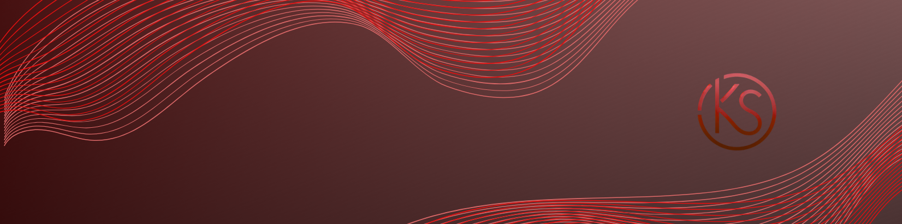

---

## 🖥️ Sobre mim

Olá! Sou <b>Kauã Alves</b>, tenho 21 anos e moro em São Paulo-SP. 
Estou cursando <b>Gestão de Tecnologia da Informação</b> na UNICID. 
E <b> Informatica para internet </b>No SENAC   
Atualmente sou um <b>futuro Desenvolvedor Full Stack</b>, buscando minha primeira oportunidade como <b>Desenvolvedor Júnior</b>. 
Sou apaixonado por tecnologia, adoro desafios e estou sempre aprendendo novas ferramentas e boas práticas de desenvolvimento.

---

## 🛠️ Habilidades Técnicas

  
  
  
  
  
  
  
  
  
  
  

---

## 📌 Projetos em Destaque

<b>Landing Page Pet</b> – Página responsiva para pet shop, com React e design moderno. 
<b>gitpes</b> – Aplicação React que consome a GitHub API para buscar repositórios. 
<b>dashboarShadcnui</b> – Dashboard interativo com TypeScript, React e Shadcn/UI. 
<b>meusite MVC</b> – Sistema web para gerenciamento de contatos com ASP.NET MVC. 
<b>ApiCrudCliente</b> – API RESTful em Node.js para CRUD de clientes. 
<b>ApiCSharp</b> – API desenvolvida em C# e .NET Core para manipulação de dados. 

---

## 🌐 Contato

  
  

---

## 📊 Estatísticas do GitHub

  
  

---

