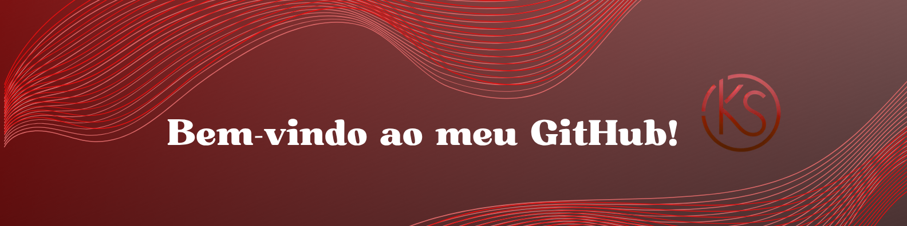

<!-- CAPA E INTRODUÇÃO -->

  
  
  
  

 

<!-- SOBRE MIM -->
<h2 align="center" style="color:#e11111;">🖥️ Sobre Mim</h2>

Sou <b style="color:#ffffff;">Kauã Alves</b>, tenho 21 anos e moro em <b>São Paulo-SP</b>. 
Cursando <b>Gestão de Tecnologia da Informação</b> na <b>UNICID</b> e <b>Informática para Internet</b> no <b>SENAC</b>.  
Busco minha primeira oportunidade como <b>Desenvolvedor Júnior</b> e sonho em me tornar um <b>Desenvolvedor Full Stack</b>. 
Sou apaixonado por tecnologia, adoro desafios e estou sempre aprendendo novas ferramentas e boas práticas.

<!-- HABILIDADES -->
<h2 align="center" style="color:#e11111;">🛠️ Habilidades Técnicas</h2>

  
  
  
  
  
  
  
  
  

<!-- PROJETOS COM ANIMAÇÃO -->
<h2 align="center" style="color:#e11111;">📌 Projetos em Destaque</h2>

  
  

    <h3 style="color:#ffffff;">Landing Page Pet</h3>
    
Página moderna e responsiva feita em React.

  

  

    <h3 style="color:#ffffff;">Gitpes</h3>
    
App em React que consome a GitHub API para buscar repositórios.

  

  

    <h3 style="color:#ffffff;">Dashboard Shadcn/UI</h3>
    
Dashboard interativo com TypeScript e React.

  

  

    <h3 style="color:#ffffff;">MeuSite MVC</h3>
    
Sistema web de contatos em ASP.NET MVC.

  

  

    <h3 style="color:#ffffff;">ApiCrudCliente</h3>
    
API RESTful em Node.js para CRUD de clientes.

  

  

    <h3 style="color:#ffffff;">ApiCSharp</h3>
    
API em C# e .NET Core para manipulação de dados.

  

 

💡 Passe o mouse sobre os projetos para ver o efeito!

<!-- CONTATO -->

<h2 align="center" style="color:#e11111;">🌐 Contato</h2>

  
  

<!-- ESTATÍSTICAS -->

<h2 align="center" style="color:#e11111;">📊 Estatísticas do GitHub</h2>

  
  

 

