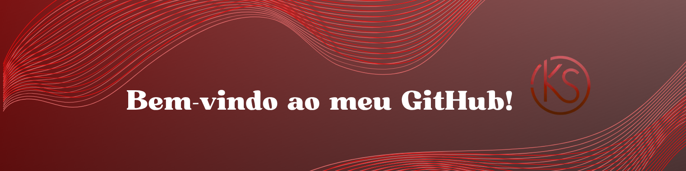

<div align="center">




<br>

[](mailto:kauasouzaalves04@gmail.com)
[](https://www.linkedin.com/in/kau%C3%A3-alves-001753313/)
[](https://kaua-stack.github.io/portfolio-/)

<br>


</div>

<br>

## 🖥️ Sobre Mim

> Tenho 22 anos e moro em **São Paulo - SP**. Sou formado em **Gestão de Tecnologia da Informação** pela **UNICID** e atualmente curso **Informática para Internet** no **SENAC**.

Estou em busca da minha primeira oportunidade como **Desenvolvedor Júnior**, com o objetivo de evoluir e me tornar um **Desenvolvedor Full Stack**. Gosto de resolver problemas, aprender novas tecnologias e aplicar boas práticas de desenvolvimento no dia a dia.

```
🔭 Atualmente desenvolvendo:  projetos full stack em JS/TS, PHP e C#
🌱 Aprendendo:                TypeScript e back-end com Node.js
💬 Posso falar sobre:         front-end, JavaScript e desenvolvimento web
📫 Contato:                   kauasouzaalves04@gmail.com
```


## 🛠️ Habilidades Técnicas

<div align="center">


</div>


## 📌 Projetos em Destaque

<div align="center">

| Projeto | Descrição | Tecnologia |
|---|---|---|
| 🔎 [**Gitpes**](https://github.com/kaua-stack/gitpes) | API de pesquisa de repositórios do GitHub | JavaScript |
| 📊 [**Dashboard Shadcn/UI**](https://github.com/kaua-stack/dashboarShadcnui) | Painel administrativo interativo com componentes modernos | TypeScript |
| 📦 [**Sistema de Estoque**](https://github.com/kaua-stack/sistemaEstoque) | Sistema completo de controle de estoque | TypeScript |
| 👥 [**SistemaRH**](https://github.com/kaua-stack/SistemaRH) | Sistema de gestão de Recursos Humanos | JavaScript |
| 🔌 [**ApiCrudCliente**](https://github.com/kaua-stack/ApiCrudCliente) | API RESTful para CRUD de clientes | Node.js |
| 📚 [**Backend Livraria**](https://github.com/kaua-stack/backendLivraria_js) | API de back-end para gerenciamento de livraria | JavaScript |
| 🗄️ [**CRUD PHP + MySQL**](https://github.com/kaua-stack/CRUD_PHP_BD_MySQL) | CRUD completo com banco de dados relacional | PHP / MySQL |
| 🌐 [**Site em MVC**](https://github.com/kaua-stack/MeuSiteEmMVCSharp) | Sistema web estruturado em arquitetura MVC | C# |
| 📋 [**Kanban**](https://github.com/kaua-stack/kanban) | Quadro Kanban para organização de tarefas | HTML/CSS/JS |
| 📮 [**Buscador de CEP**](https://github.com/kaua-stack/BuscadordeCEP) | Consulta de endereços via API de CEP | JavaScript |

</div>

> 💡 Acesse meu [GitHub](https://github.com/kaua-stack?tab=repositories) para ver a lista completa de repositórios.


## 📊 Estatísticas do GitHub

<div align="center">


<br><br>


<br><br>


</div>


## 🐍 Atividade Recente

<div align="center">

<picture align="center">
  <source media="(prefers-color-scheme: dark)" srcset="https://raw.githubusercontent.com/kaua-stack/kaua-stack/output/dist/github-snake-dark.svg">
  <source media="(prefers-color-scheme: light)" srcset="https://raw.githubusercontent.com/kaua-stack/kaua-stack/output/dist/github-snake.svg">
  
</picture>

</div>


<br>

<div align="center">

### 🤝 Vamos conversar?

Estou aberto a oportunidades, parcerias e trocas de conhecimento. Sinta-se livre para entrar em contato!


</div>
